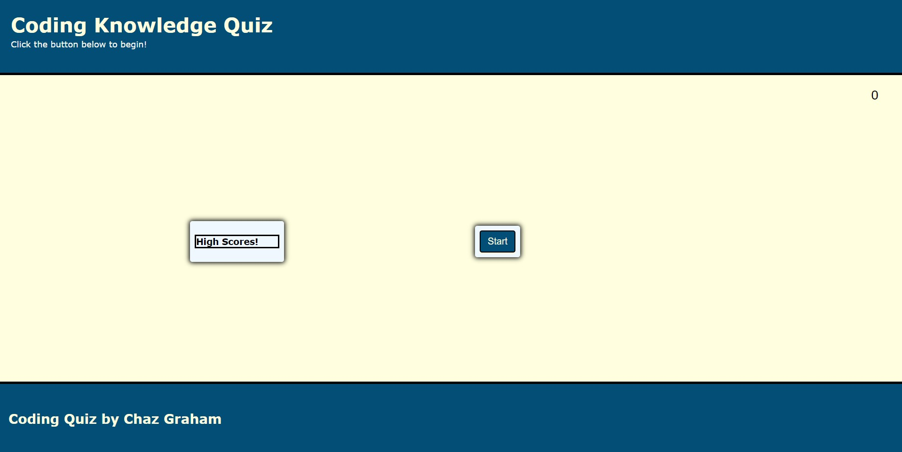
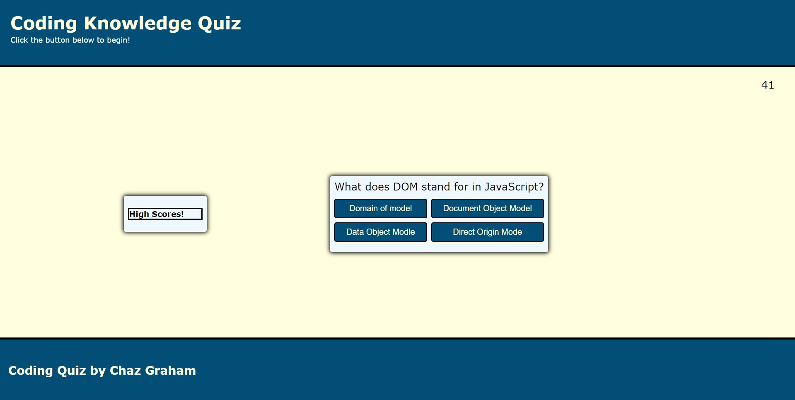
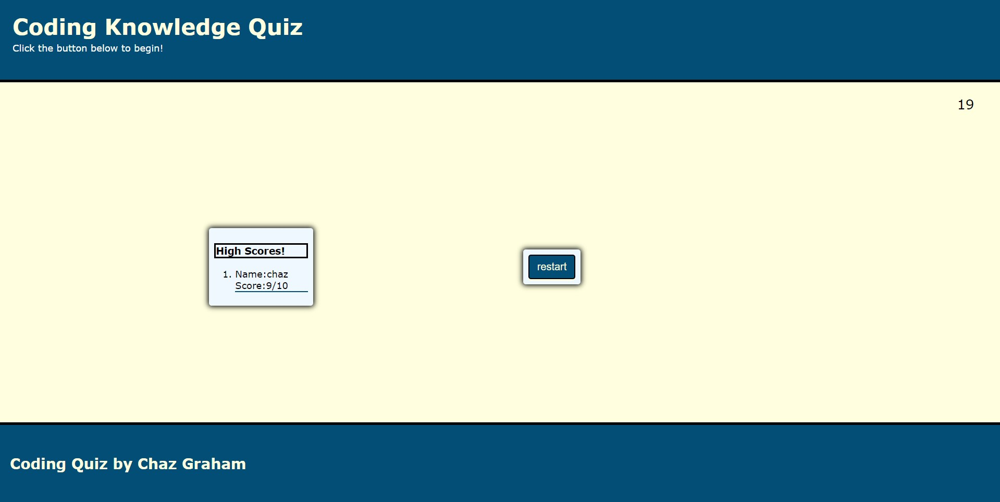

# Chazs JavaScript Knowledge Test

## Purpose
A quiz application that asks the user 10 questions realated to JavaScript, and allows user to save their score.

## Built With
*HTML
*CSS
*javaScript

## WEbsite
https://chazgraham.github.io/Chazs-JavaScript-Knowledge-Test/

## Contribution
ByChaz Graham

